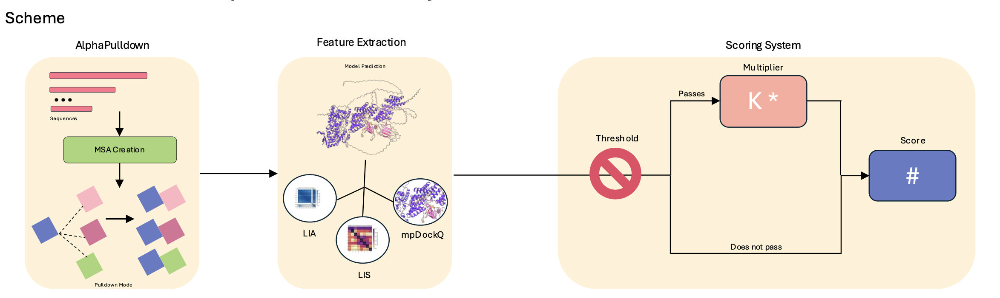

# Competition Assay

This repository contains Python code and examples for a computational interaction screening assay that integrates AlphaPulldown Pipeline with AlphaFold Metrics to rank candidate interactors based on predicted binding quality. 


## About

This code supports the findings in the paper ___________. In our chemoproteomic experiments, we identified a new candidate member of the MYST KAT complexes: **FOXK2**. To explore FOXK2's potential role in these complexes, we developed a computational interaction screening assay to understand FOXK2's ability to interact with the MYST complexes. 

## AlphaPulldown Workflow

We implemented the [AlphaPulldown Workflow](https://academic.oup.com/bioinformatics/article/39/1/btac749/6839971), and integrated the calculation of LIA and LIS scores, as described in the *Enhanced Protein-Protein Interaction Discovery via AlphaFold-Multimer* paper ([Kim et al., 2024](https://www.biorxiv.org/content/10.1101/2024.02.19.580970v1)).

We executed the AlphaPulldown v0.30.7 workflow on the NIH HPC Biowulf Cluster. MSAs were generated via ColabFold v1.5.5.

To view folder structure examples, [click here](alphapulldown_materials/FOXK2_ex).

---

### How to run AlphaPulldown on the NIH HPC Biowulf Cluster:

#### **ColabFold Search**
```bash
sinteractive --mem=128g --cpus-per-task=16 --gres=lscratch:100
module load colabfold alphapulldown/0.30.7
colabfold_search --threads $SLURM_CPUS_PER_TASK for_colabfold.fasta $COLABFOLD_DB pulldown_cf_msas
create_individual_features.py --fasta_paths=bait.fasta,candidate.fasta --output_dir=pulldown_cf_msas \
    --use_precomputed_msas=True --max_template_date=2023-01-01 \
    --use_mmseqs2=True --skip_existing=True
```

#### **AlphaPulldown**
```bash
sinteractive --mem=150g -c8 --gres=lscratch:50,gpu:a100:1 --time=3-12:00:00
module load alphapulldown/0.30.7
run_multimer_jobs.py --mode=pulldown --num_cycle=3 --num_predictions_per_model=1 \
    --output_path=pulldown_model --protein_lists=candidate.txt,bait.txt \
    --monomer_objects_dir=pulldown_cf_msas

run_get_good_pae.sh --output_dir pulldown_model --cutoff=50
```

To view example `sbatch` files, [click here](alphapulldown_materials/sbatch_ex).

---

### How to Compute LIA/LIS Scores

The input CSV must contain the following columns:
- `average lia score`
- `lis_score`

These are computed using AlphaPulldown and the `lia_lis.py` script from [frag_af](https://github.com/castral02/frag_af).

```bash
python3 lia_lis.py -output_dir=/path/to/AlphaPulldown/output/folders
```

Example [output file](alphapulldown_materials/alphapulldown_output.csv)

---

## Competition Assay

### Developing Metrics

Previous research explored a multitude of AlphaFold Metrics for understanding protein-protein interactions (Bertoline et al., 2023). Our goal was to develop a single interaction score that summates multiple AlphaFold Docking metrics, normalized, and weighted to a threshold passing constant. 

We focused on two key docking scores:
- [mpDockQ/pDockQ](https://www.nature.com/articles/s41467-022-33729-4)
- [LIA/LIS](https://www.biorxiv.org/content/10.1101/2024.02.19.580970v1)

We assed each interaction by filtering each metric discretely to asses the confidence and accuracy of each binding. Minimum acceptable thresholds were 1610 (LIA), 0.073 (LIS), and 0.175 (mpDockQ/pDocKQ). In a binary fashion, metrics were assessed as pass or no pass. 

To quantify these binary assessments, we introduced a weighted constant (k). If the interaction passed all three thresholds, the weight was assigned 1.0; if the interaction passed two out of three, the weighted was assigned 0.75; if the interaction passed one out of three, the weight was assigned 0.5; and lastly, if the interaction failed all three, we could assume that the binding prediction is inaccurate equating the weight to zero. 

Each metric was min-max normalized, added, and then multiplied by the weighted constant generating the composite score. The resulting composite scores were used to rank the candidate interactions in descending order, enabling prioritization of high-confidence protein-protein interactions to explore. 


Full workflow illustrated below:

### Workflow Diagram


---

### How to Run

**Installation:**
```bash
git clone https://github.com/castral02/competition_assay
cd code
python3 competition_assay.py -csv_path=/path/to/csv/file -name=Protein
```

### Dependencies
```bash
absl-py
pandas
```

The [output CSV](examples/output_competition_assay_ex.csv) contains:
- Original input columns that comes from the AlphaPulldown and LIA/LIS Pipeline
- Normalized values for each metric
- Composite_Score
- Rank

Example:
| Job     |...| mpDockQ/pDockQ| lis_score | ... | Composite_Score  | Rank |
|---------|---|---------------|-----------|-----|------------------|------|
| FOXK2   |...|0.74           | 0.12      | ... | 2.45             | 1    |

---

## Exploring Interface Contacts

To understand which residues are in contact between bait and candidate proteins, we developed two scripts compatible with AlphaFold2 and AlphaFold3 outputs.

### How to Run

**Installation:**
```bash
git clone https://github.com/castral02/competition_assay
cd code/interface_residues
python outputs.py -file /path/to/alphafold/summary/json/file  # For AF3
```

AlphaFold2 workflows require a `.pickle` file instead of JSON.

➡️ Example [AF3 output file](examples/wdr5_foxk2_human_af3_ex.csv)

➡️ Example [AF2 output file](examples/wdr5_foxk2_human_af2_ex.csv)

### Dependencies
```bash
json
pickle
biopython
scipy
pandas
absl-py
numpy
```

---

## Declaration of Generative AI Usage

This project utilized OpenAI's ChatGPT to assist in generating Python code, documentation, and explanatory content.

---

## References

- Bertoline, Letícia M. F., et al. “Before and after AlphaFold2: An Overview of Protein Structure Prediction.” Frontiers in Bioinformatics, vol. Volume 3-2023, 2023. [Paper Link](https://doi.org/10.3389/fbinf.2023.1120370)

- Bryant, P., Pozzati, G., Zhu, W. et al. *Predicting the structure of large protein complexes using AlphaFold and Monte Carlo tree search*. **Nat Commun**, 13, 6028 (2022). [Paper Link](https://doi.org/10.1038/s41467-022-33729-4)

- Dingquan Yu, Grzegorz Chojnowski, Maria Rosenthal, Jan Kosinski. *AlphaPulldown—a Python package for protein–protein interaction screens using AlphaFold-Multimer*, **Bioinformatics**, 39(1), 2023. [Paper Link](https://doi.org/10.1093/bioinformatics/btac749)

- Kim AR, Hu Y, Comjean A, Rodiger J, Mohr SE, Perrimon N. *Enhanced Protein-Protein Interaction Discovery via AlphaFold-Multimer*. **bioRxiv** (2024). [Paper Link](https://www.biorxiv.org/content/10.1101/2024.02.19.580970v1)

> This work utilized the computational resources of the [NIH HPC Biowulf cluster](https://hpc.nih.gov).
